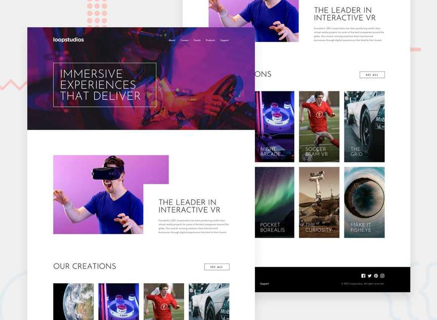

# Loopstudios landing page

Landing page challenge for [Frontend Mentor](https://www.frontendmentor.io).

Although not included in the original requirements, I've decided to:
- Use Sass for styling.
- Build a dynamic, sticky mobile nav in vanilla JS.
- Configure Webpack to create development/production builds (transpiling JS code, adding CSS vendor prefixes, minifying, etc.)

Original challenge (given JPGs for desktop, mobile, and active views):
> Your challenge is to build out this landing page and get it looking as close to the design as possible.
> 
> This challenge focuses mostly on HTML & CSS. There's a tiny bit of JS included for the mobile navigation toggle. But you could also choose to do this without JS!
> 
> You can use any tools you like to help you complete the challenge. So if you've got something you'd like to practice, feel free to give it a go.
> 
> Your users should be able to:
> 
> - View the optimal layout for the site depending on their device's screen size
> - See hover states for all interactive elements on the page

